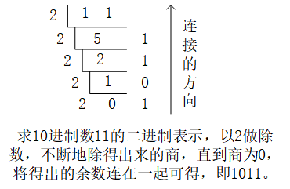
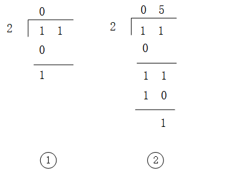
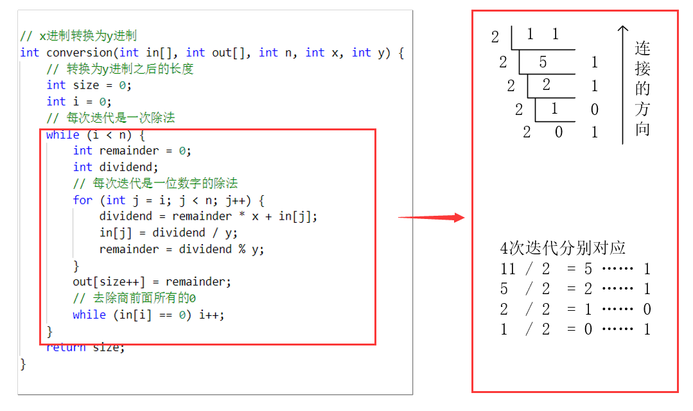
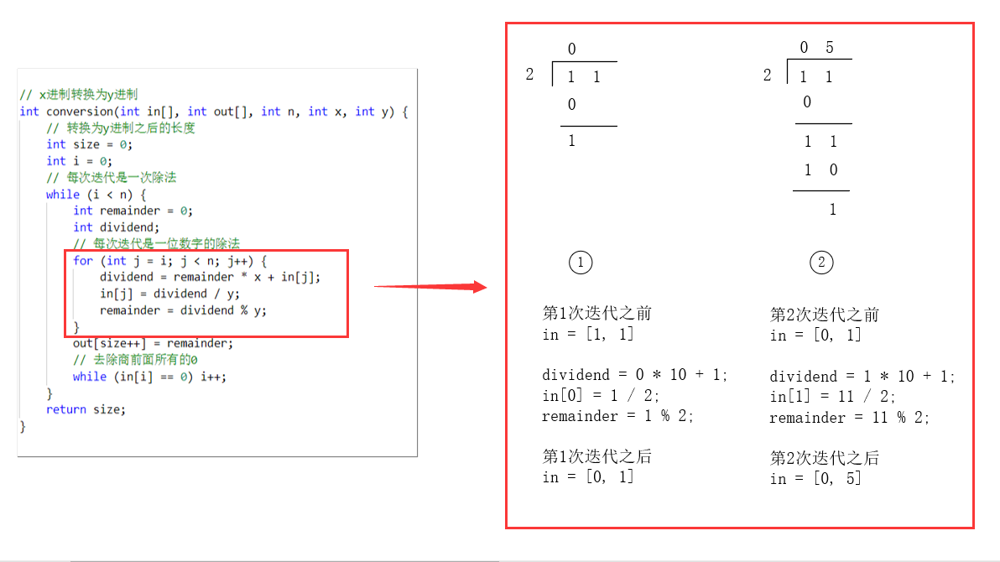

# 大数进制转换

## 参考网页：

 https://blog.csdn.net/sjf0115/article/details/8690581?utm_source=copy

## 思路：

对于数值不是很大可以直接表示的数，以求10进制数11的2进制表示为例，我们可以使用如下的方法直接进行进制转换：



但是对于较大的数如1000位的数（数字有1000个，不是1000字节），我们无法直接表示，因此不能直接得出，但是我们可以将上述过程分解。观察上述运算，其实是经过了4次除法（11 / 2，5 / 2，2 / 2，1 / 2）得出4个余数，而对于每次的除法，我们依然可以继续分解。

以11 / 2为例，可以分解为如下两个过程

1. 十位的1除以2，商为0，余数为1；
2. 个位的1除以2，但是因为10位除以2的时候有余数1，因此需要加上之前的余数，即被除数 = 1 * 10 + 1 = 11，个位的运算因此应该为11 / 2，商为5，余数为1，得出第一个余数1。



然后将05前面所有的0去掉变成5，使用5继续除以2，重复此过程直到商为0。

## 代码：

根据上述思想，我们可以使用数组存储大数，然后通过将计算分解完成大数的进制转换，完整代码：

```c++
#include <iostream>
using namespace std;

// x进制转换为y进制
int conversion(int in[], int out[], int n, int x, int y) {
    // 转换为y进制之后的长度
    int size = 0;
    // 每次迭代是一次除法
    int i = 0;
    while (i < n) {
        int remainder = 0;
        int dividend;
        // 每次迭代是一位数字的除法
        for (int j = i; j < n; j++) {
            dividend = remainder * x + in[j];
            in[j] = dividend / y;
            remainder = dividend % y;
        }
        out[size++] = remainder;
        // 去除商前面所有的0
        while (in[i] == 0) i++;
    }
    return size;
}


int main() {
    string s;
    int in[100];
    int out[100];
    while (cin >> s) {
        // 输入
        int n = s.length();
        for (int i = 0; i < n; i++) {
            in[i] = s[i] - '0';
        }

        // 10进制转换为2进制
        int size = conversion(in, out, n, 10, 2);

        // 输出，需要逆序输出
        for (int i = size - 1; i >= 0; i--) {
            cout << out[i];
        }
        cout << endl;
    }
}

```

代码的详细解释，以求10进制数11的二进制表示为例：





## 练习：

北大考研机试 [进制转换](<https://www.nowcoder.com/practice/0337e32b1e5543a19fa380e36d9343d7?tpId=40&tqId=21361&tPage=2&rp=2&ru=/ta/kaoyan&qru=/ta/kaoyan/question-ranking>)

清华考研机试 [10进制 VS 2进制](<https://www.nowcoder.com/practice/fd972d5d5cf04dd4bb4e5f027d4fc11e?tpId=40&tqId=21357&tPage=2&rp=2&ru=/ta/kaoyan&qru=/ta/kaoyan/question-ranking>)

